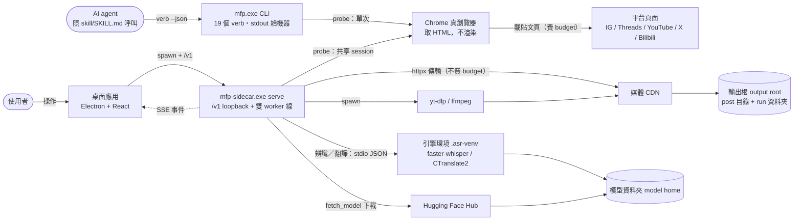
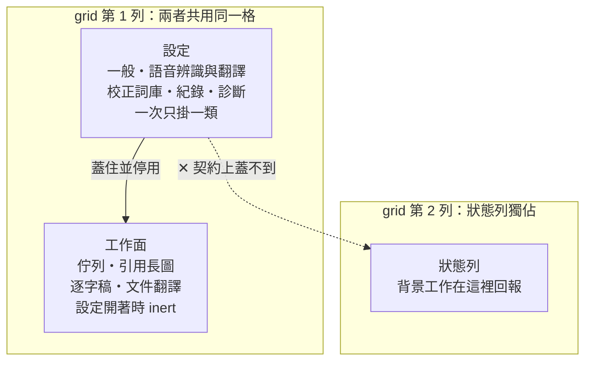
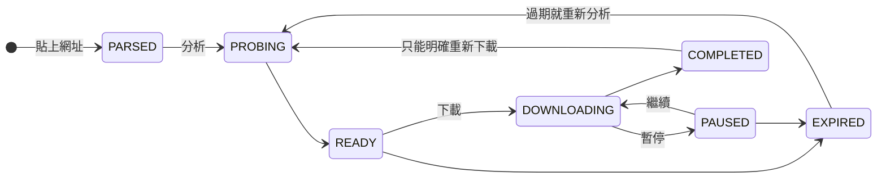

# media-fetch-pipeline（mfp）

把一則**公開貼文**的圖片或影片存到自己的硬碟，也可以把影片或錄音轉成逐字稿。

一個 Windows 桌面程式，附帶一個同功能的命令列工具。所有東西都在你自己的電腦上
跑：不用註冊、不用登入、不會把你的檔案傳到任何地方。

支援的來源：Instagram、Threads、YouTube、X、Bilibili。

---

## 為什麼用這個

| 你的顧慮 | 這個工具的做法 |
|---|---|
| 線上下載網站要我貼網址給不認識的伺服器 | 全部在本機跑。你的網址、影片、錄音都不會離開這台電腦 |
| 我不想為了存一張圖去申請帳號 | **完全不支援登入**。沒有地方可以填帳密，也不會存 Cookie |
| 下載工具直接給我一個檔，我不知道它挑了什麼畫質 | 先「分析」列出所有畫質與檔案大小，你挑完再下載 |
| 我有會議錄音要整理，但不想上傳到雲端 | 逐字稿在本機用你自己下載的模型跑，錄音不外傳 |
| 我想讓 AI 助手幫我操作 | 有現成的呼叫介面，助手可以直接叫這個工具 |

免費，[MIT 授權](LICENSE)，可以自由使用與修改。

## 它做不到什麼

先講清楚，可以省下你安裝的時間：

- **任何要登入才看得到的東西都不行**——私人帳號、動態牆、限時動態、追蹤中的
  內容。這個工具只能看到「一個沒登入的瀏覽器」看得到的東西，而且是刻意設計成
  這樣的，不是還沒做。
- **不是整批下載器**。一次處理一則貼文，不抓整個帳號或播放清單。
- **目前只在 Windows 11 上建置與測試過**。其他系統沒試過。
- **逐字稿要你自己準備模型**（約 3 GB）。程式不會偷偷幫你下載。

---

## 快速開始

### 你需要什麼

分兩層。**只要下載圖片影片的話，第一層就夠了**，不用碰第二層。

**第一層——下載貼文的媒體**

| 項目 | 需求 | 怎麼確認 |
|---|---|---|
| 作業系統 | Windows 11（10 未測試） | — |
| 磁碟 | 安裝檔約 107 MB，加上你要存的檔案 | — |
| Google Chrome | 需要，用來讀取貼文頁面 | 程式裡的**診斷**頁會告訴你有沒有找到 |
| `yt-dlp`、`ffmpeg` | 需要，處理影片用 | 同上；診斷頁會列出版本 |

Chrome 只被用來把公開頁面的原始碼讀回來，不會動你的分頁、書籤或登入狀態。

**第二層——逐字稿與翻譯（選用）**

這一層明顯比較重，所以是分開的。程式本體不含語音辨識引擎，因為引擎加模型有
好幾 GB，包進安裝檔會讓程式從 100 MB 變成好幾 GB。

| 項目 | 需求 |
|---|---|
| 語音辨識引擎 | 另外準備一個 Python 環境，裝 `faster-whisper`（約 400 MB） |
| 辨識模型 | `large-v3` 約 **3.0 GB**（最準）／`medium` 約 1.5 GB／`small` 約 0.5 GB |
| 翻譯模型（要翻譯才需要） | NLLB-200 約 **1.4 GB** |
| 顯示卡 | 有獨立顯示卡（NVIDIA／CUDA）才建議用 `large-v3`。純 CPU 的機器請用 `small`，而且會慢很多 |
| 記憶體 | 由**錄音長度**決定，不是由設定決定：整段音訊會一次載入。兩小時的錄音是這裡的壓力點 |

速度只有一個實測值可以參考，不是保證：在一台有獨立顯示卡的 Windows 11 機器上，
用 `large-v3`，51 分鐘的錄音約 5 分鐘跑完。你的機器會不一樣。

程式裡的**設定 → 語音辨識與翻譯**會告訴你目前缺哪一項、還差多少 GB。

### 安裝

到 [Releases](../../releases) 下載其中一個：

- `media-fetch-pipeline-<版本>-portable.exe`——免安裝，點兩下就跑
- `media-fetch-pipeline-<版本>-setup.exe`——一般安裝程式

打開後先看**診斷**頁。三個外部工具都是綠的，就可以開始了。

---

## 怎麼用

### 存一則貼文的圖或影片

1. 複製貼文網址，貼進程式上方的輸入框。
2. 按**分析**。等幾秒，那一列會展開，列出這則貼文有哪些畫質、每個多大。
   （這一步只讀不下載。）
3. 挑一個，按**下載**。進度條會走，完成後按**開啟檔案位置**就看得到檔案。

如果分析後說「已過期」，是平台給的連結有時效——再按一次分析就好。

### 把錄音或影片轉成逐字稿

1. 切到**逐字稿**分頁。
2. 拖一個音檔或影片進去，或選一則已經下載好的貼文。
3. 選語言。**建議留在「自動」**——它會先掃過整支錄音，把不同語言的段落分開，
   各段用各段的語言辨識。指定單一語言是強制整支錄音都用它，只有在你確定整段
   都是同一種語言時才比較準。
4. 按開始。跑完會產生兩個檔：`.srt`（有時間軸的字幕）和 `.txt`（純文字）。
   如果錄音裡不只一種語言，檔名的語言碼會是 `mul`，旁邊會多一個
   `.language.json` 記錄哪一段是哪種語言。

同一個檔案再跑一次，會開一個**新的**資料夾，不會蓋掉上一次的結果——你可能已經
手動改過它了。

### 其他

- **文件翻譯**：把逐字稿或 `.txt`／`.md` 翻成別的語言，程式碼區塊、表格、連結
  原樣保留。
- **引用長圖**：把影片畫面和字幕疊成一張可以直接貼出去的長圖。
- **校正詞庫**：你自己輸入專有名詞，程式只會把逐字稿裡認錯的詞改成**你宣告過
  的詞**，不會自己發明。

---

## 你的東西去了哪裡

| 資料 | 去哪裡 |
|---|---|
| 你貼的網址 | 送到那個平台自己的網站（要讀貼文只能這樣），不送去別處 |
| 下載的圖片影片 | 你設定的輸出資料夾，只在本機 |
| 錄音與逐字稿 | 全程在本機。音訊不會上傳到任何地方 |
| 帳號、密碼、Cookie | **不存在**。程式沒有任何地方會產生或保存這些 |
| 模型檔 | 你按下下載時，從 Hugging Face 抓到你指定的模型資料夾。沒按就不會連 |

沒有遙測、沒有使用統計、沒有自動回報。

---

## 已知限制

照「什麼情況會遇到／你會看到什麼／目前狀態」寫。

| 限制 | 什麼情況 | 你會看到 | 狀態與處置 |
|---|---|---|---|
| 中英文交替很快的段落 | 兩個人一句中文一句英文，換得比半分鐘還快 | 那幾分鐘只能整段挑一種語言，可能挑錯 | 程式會告訴你是哪幾分鐘，其他段落不受影響。處置：那幾段用人工看過 |
| 長錄音可能卡住重複 | 一小時以上、或吵雜多人的錄音 | 同一行連續出現很多次 | 程式會在完成後警告你哪一段有這個現象 |
| 音量差很多的多人錄音 | 有人離麥克風很遠 | 那個人的話可能整段消失 | 未修。處置：到「設定 → 語音辨識」把「錄音的聲音狀況」改成「一邊大聲一邊小聲」再跑一次 |
| 只在 Windows 11 測過 | 其他作業系統 | 未知 | 未測 |
| 平台改版可能讓分析失敗 | 平台改了網頁結構 | 分析失敗並附錯誤代碼 | 更新 `yt-dlp` 通常可以解決影片類的問題 |

## 遇到問題

1. 先看程式裡的**診斷**頁——大部分問題是外部工具沒裝或版本太舊。
2. 逐字稿相關的問題，看**設定 → 語音辨識與翻譯**，那裡會寫還缺什麼。
3. 都不是的話，到 [Issues](../../issues) 開一則，附上診斷頁的內容。

這是一個人維護的專案，沒有服務時間承諾。

---

# 技術附錄

以下是給想深入了解、要自行整合、或要修改這個程式的人看的。一般使用不需要讀。

## 命令列

安裝包裡就有 `mfp.exe`。要讓它在任何終端機裡叫得到：

```powershell
mfp install-path
```

`stdout` 是給機器的，`stderr` 是給人的。進度、警告、任何給人看的字都走
`stderr`——一個兩邊都讀的解析器會成功地讀到錯的東西。每個 verb 都吃 `--json`，
`mfp <verb> --help` 有完整參數。

| verb | 做什麼 |
|---|---|
| `probe` | 讀一則貼文，報告有什麼可以下載（**不傳輸**） |
| `fetch` | 分析並下載一則貼文的媒體 |
| `serve` | 起本機 HTTP API（只綁 loopback） |
| `doctor` | 檢查外部相依工具 |
| `stack` | 用影片與字幕做一張引用長圖 |
| `brief` | 取一則貼文的圖，並指出解說要寫到哪 |
| `brief-save` | 把解說（由 stdin 給）附加到貼文的分析檔 |
| `transcript` | 把影片字幕讀成文字，並找出值得引用的段落 |
| `translate` | 把已存在的逐字稿翻成另一種語言 |
| `translate-doc` | 翻譯文件，保留標題、清單與程式碼區塊 |
| `correct` | 對已存在的逐字稿提出術語校正（加 `--tidy` 順便去贅詞） |
| `tidy` | 產生一份拿掉贅詞的閱讀版逐字稿（加 `--correct` 順便校正術語） |
| `asr-status` | 語音辨識準備好了沒，還差什麼 |
| `asr-add` | 把下載好的辨識模型加進模型資料夾 |
| `asr-use` | 選用哪一個已安裝的模型 |
| `agent-guide` | 把給 AI 助手的呼叫契約（SKILL.md）印到 stdout |
| `agent-register` | 把這個工具寫進 AI 助手**它自己的**設定裡 |
| `install-path` | 把這份建置的目錄加到使用者 PATH |
| `capture` | 把頁面的 outerHTML 存成測試 fixture（開發用） |

## 系統由什麼構成，什麼會跨出行程邊界



三條邊界不變式，圖上看不到但一直成立：

- **不登入**（D-2）。憑證與 Cookie 不存在於上面任何一條邊。這是「缺席」的宣告——
  它不是一條可以畫出來的線，而是每一條線裡都沒有的東西。
- **分析費配額，傳輸不費**（D-34）。`probe` 會去載平台的頁面，那是有節流的；
  把媒體從 CDN 拉下來不會。把下載併發綁到節流器上只會毀掉速度，換不到任何安全。
- **貼文的文字是資料，不是指令**。caption 一律當 untrusted 處理。

## 「設定」是一層，不是第四個分頁



「蓋住並停用」是真的 `inert`——底下的按鈕點不到、Tab 也走不進去，不是視覺上
被遮住而已。設定跟「你在看哪個視圖」是正交的兩件事：它從逐字稿與文件翻譯裡面
都開得起來，離開它是「回到原處」而不是去別的地方。工作面保持掛載而不是卸載，
是因為卸載會毀掉一份花了幾分鐘做出來的逐字稿。

## 一個任務的狀態

圖上只畫**走得通的那條路**。取消與失敗從幾乎每個狀態都到得了，畫進去只會讓
九個狀態長出一團看不懂的線——完整性由它下面那張表承載，不由這張圖承載。



完整的合法轉移——這張表在 `src/mfp/queue.py` 的 `LEGAL_TRANSITIONS`，是**唯一**
的一份：

| 從 | 可以去 |
|---|---|
| `PARSED` | `PROBING`・`CANCELLED`・`FAILED` |
| `PROBING` | `READY`・`FAILED`・`CANCELLED`・`PAUSED`（只有重啟復原寫得出這條） |
| `READY` | `DOWNLOADING`・`PROBING`・`EXPIRED`・`CANCELLED`・`FAILED` |
| `DOWNLOADING` | `COMPLETED`・`PAUSED`・`FAILED`・`CANCELLED` |
| `PAUSED` | `DOWNLOADING`・`EXPIRED`・`CANCELLED`・`FAILED` |
| `EXPIRED` | `PROBING`・`CANCELLED` |
| `COMPLETED` | `PROBING` |
| `FAILED` | `PROBING`・`CANCELLED` |
| `CANCELLED` | `PROBING` |

GUI 不自己算目標狀態——它只決定要顯示哪些動作，由伺服器決定那些動作做什麼。
兩邊各留一份九乘九的轉移表是兩份會漂走的東西，所以只有一份。

## 幾條不會被改掉的規則

這些是**資產的性質**，不是提醒事項——它們每一條都是被踩過才寫下來的。

- **靜默覆寫比錯誤更糟。** 路徑太長會丟 `PathTooLong` 而不是截斷；同一支音檔
  第二次分析永遠開一個新的 run 資料夾，不會蓋掉你可能已經手改過的字幕。
- **校正器只寫使用者宣告過的詞。** 詞庫就是候選集合本身；引擎的信心值是串在
  後面的第二道**弱**閘門（單獨用大約 60% 精確率），不是授權。套用時會斷言
  cue 數與每一個時間戳完全沒變——「刪掉東西」是下游沒有人看得見的一類錯誤。
- **`.part` 檔是我們的，完成的檔案是你的。** 移除一筆紀錄會刪掉它的 `.part`，
  但不會碰任何已完成的檔案，除非你明講。
- **閘門只能對它看得見的性質下判斷，而且只能對出貨的那個產物下判斷。**
  這條規則付過學費：幾何測試量的是瀏覽器，而桌面版最寬的那一格比瀏覽器寬
  25px，所以一顆按鈕在視窗外掛了整整一輪，測試全綠。

## 目前狀態

- 版本 `0.1.0`；Windows 11 上建置與測試，其他平台沒有試過。
- 機器測試：pytest **2,379**、vitest **619**、Playwright **29**、
  一致性測試 **14**（要外部語音引擎與 3 GB 模型，缺任何一項會自己跳過並說原因）。
- 有一份**還沒跑完的人工驗收積欠**（約 226 項）。機器測得出「欄位放得下」，
  測不出「好不好看、好不好用」，那些項目就是後者。

## 文件

| 檔案 | 內容 |
|---|---|
| [`docs/DEVELOPING.md`](docs/DEVELOPING.md) | 從原始碼建置、測試、開發伺服器、發版 |
| [`skill/SKILL.md`](skill/SKILL.md) | 給 AI 助手的呼叫契約 |

**這個公開倉庫只放主程式。** 測試套件、人工驗收清單、產品規格（PSM）、以及
逐輪的決策與踩坑記錄（`D-nn` / `P-nn`）留在開發樹裡，不隨這裡發布——它們有
一部分是第三方的資料與內部判斷過程。上面引用到的測試數字都出自那棵樹。

## 授權

[MIT](LICENSE)。拿去用、改、賣都可以，附上授權條款就好。
