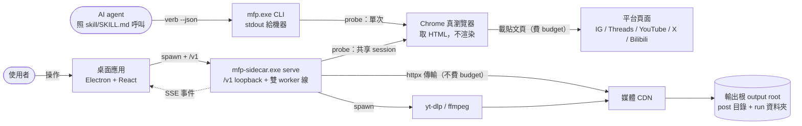
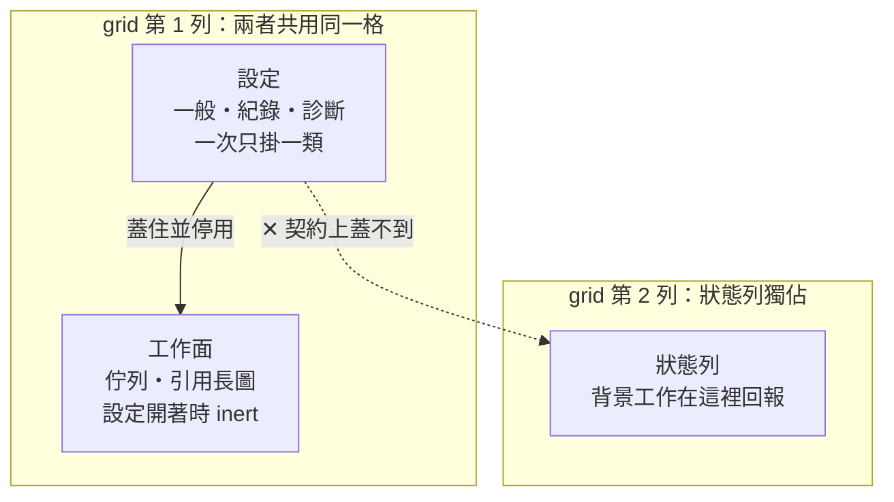
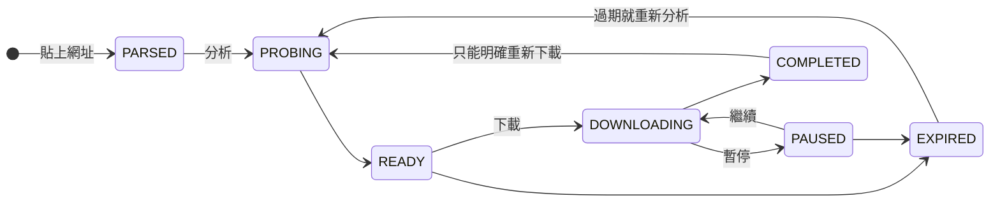

# media-fetch-pipeline（mfp）

把一則**公開貼文**的圖片或影片存到自己的硬碟。

一個 Windows 桌面程式，附帶一個同功能的命令列工具。所有東西都在你自己的電腦上
跑：不用註冊、不用登入、不會把你的檔案傳到任何地方。

支援的來源：Instagram、Threads、YouTube、X、Bilibili。

---

## 為什麼用這個

| 你的顧慮 | 這個工具的做法 |
|---|---|
| 線上下載網站要我貼網址給不認識的伺服器 | 全部在本機跑。你的網址和下載下來的檔案都不會離開這台電腦 |
| 我不想為了存一張圖去申請帳號 | **完全不支援登入**。沒有地方可以填帳密，也不會存 Cookie |
| 下載工具直接給我一個檔，我不知道它挑了什麼畫質 | 先「分析」列出所有畫質與檔案大小，你挑完再下載 |
| 我想讓 AI 助手幫我操作 | 有現成的呼叫介面，助手可以直接叫這個工具 |

免費，[MIT 授權](LICENSE)，可以自由使用與修改。

## 它做不到什麼

先講清楚，可以省下你安裝的時間：

- **任何要登入才看得到的東西都不行**——私人帳號、動態牆、限時動態、追蹤中的
  內容。這個工具只能看到「一個沒登入的瀏覽器」看得到的東西，而且是刻意設計成
  這樣的，不是還沒做。
- **不是整批下載器**。一次處理一則貼文，不抓整個帳號或播放清單。
- **不做逐字稿，也不做翻譯**。影片會完整存下來，但影片裡說了什麼，要用別的工具
  處理。這兩項功能在 2026-09-16 從這個工具移除。
- **目前只在 Windows 11 上建置與測試過**。其他系統沒試過。

---

## 快速開始

### 你需要什麼

| 項目 | 需求 | 怎麼確認 |
|---|---|---|
| 作業系統 | Windows 11（10 未測試） | — |
| 磁碟 | 安裝檔約 107 MB，加上你要存的檔案 | — |
| Google Chrome | 讀 Instagram 和 Threads 的貼文需要；YouTube、X、Bilibili 不需要 | 程式裡的**診斷**頁會告訴你有沒有找到 |
| `yt-dlp`、`ffmpeg` | 需要，下載和合併影片用 | **不用自己裝**——第一次打開程式時會問你，按一下就好 |

`yt-dlp` 和 `ffmpeg` 沒有包進安裝檔，這是刻意的：`yt-dlp` 幾乎每週改版，包一份
進去，一個月後就是壞的。程式改成需要的時候自己去官方來源抓（yt-dlp 約 18 MB、
ffmpeg 約 106 MB），放進程式自己的資料夾，不會動到系統設定、也不需要系統管理員
權限，抓回來的檔案都會跟發行方公布的檔案指紋比對過才安裝。你要自己裝也可以，
程式會用系統上原本就有的那份，並且會在**設定 → 診斷 → 需要的程式**明白告訴你
現在跑的是哪一份。

Chrome 是唯一一個程式不會幫你裝的——幫人裝瀏覽器不是一個下載工具該做的事，
那一列只會給你官方下載連結。它也只被用來把公開頁面的原始碼讀回來，不會動你的
分頁、書籤或登入狀態。

### 安裝

到 [Releases](../../releases) 下載其中一個：

- `media-fetch-pipeline-<版本>-portable.exe`——免安裝，點兩下就跑
- `media-fetch-pipeline-<版本>-setup.exe`——一般安裝程式

打開後先看**診斷**頁。三個外部工具都是綠的，就可以開始了。

---

## 怎麼用

### 存一則貼文的圖或影片

1. 複製貼文網址，貼進程式上方的輸入框。
2. 按**分析**。等幾秒，那一列會展開，列出這則貼文有哪些畫質、每個多大。
   （這一步只讀不下載。）
3. 挑一個，按**下載**。進度條會走，完成後按**開啟檔案位置**就看得到檔案。

如果分析後說「已過期」，是平台給的連結有時效——再按一次分析就好。

### 其他

- **一併存字幕**：影片本身有字幕軌的話，在影片旁邊多存一個 `.srt`，語言是影片
  裡實際說的那一種（不是翻譯）。預設關，在設定裡開，貼網址那一列也可以只對這一次
  打勾。沒有字幕軌的影片照常下載。
- **引用長圖**：把影片畫面和字幕疊成一張可以直接貼出去的長圖。

---

## 你的東西去了哪裡

| 資料 | 去哪裡 |
|---|---|
| 你貼的網址 | 送到那個平台自己的網站（要讀貼文只能這樣），不送去別處 |
| 下載的圖片影片 | 你設定的輸出資料夾，只在本機 |
| 帳號、密碼、Cookie | **不存在**。程式沒有任何地方會產生或保存這些 |

沒有遙測、沒有使用統計、沒有自動回報。

---

## 已知限制

照「什麼情況會遇到／你會看到什麼／目前狀態」寫。

| 限制 | 什麼情況 | 你會看到 | 狀態與處置 |
|---|---|---|---|
| 只在 Windows 11 測過 | 其他作業系統 | 未知 | 未測 |
| 平台改版可能讓分析失敗 | 平台改了網頁結構 | 分析失敗並附錯誤代碼 | 更新 `yt-dlp` 通常可以解決影片類的問題 |

## 遇到問題

1. 先看程式裡的**診斷**頁——大部分問題是外部工具沒裝或版本太舊。
2. 不是的話，到 [Issues](../../issues) 開一則，附上診斷頁的內容。

這是一個人維護的專案，沒有服務時間承諾。

---

# 技術附錄

以下是給想深入了解、要自行整合、或要修改這個程式的人看的。一般使用不需要讀。

## 命令列

安裝包裡就有 `mfp.exe`。要讓它在任何終端機裡叫得到：

```powershell
mfp install-path
```

`stdout` 是給機器的，`stderr` 是給人的。進度、警告、任何給人看的字都走
`stderr`——一個兩邊都讀的解析器會成功地讀到錯的東西。每個 verb 都吃 `--json`，
`mfp <verb> --help` 有完整參數。

| verb | 做什麼 |
|---|---|
| `probe` | 讀一則貼文，報告有什麼可以下載（**不傳輸**） |
| `fetch` | 分析並下載一則貼文的媒體 |
| `serve` | 起本機 HTTP API（只綁 loopback） |
| `doctor` | 檢查外部相依工具 |
| `stack` | 用影片與字幕做一張引用長圖 |
| `brief` | 取一則貼文的圖，並指出解說要寫到哪 |
| `brief-save` | 把解說（由 stdin 給）附加到貼文的分析檔 |
| `analyzed` | 這個網址或檔案分析過了沒、結果放在哪 |
| `agent-guide` | 把給 AI 助手的呼叫契約（SKILL.md）印到 stdout |
| `agent-register` | 把這個工具寫進 AI 助手**它自己的**設定裡 |
| `tools` | 列出 yt-dlp／ffmpeg／Chrome 的狀態與**現在跑的是哪一份**；`--install` 幫你抓一個回來 |
| `install-path` | 把這份建置的目錄加到使用者 PATH |
| `capture` | 把頁面的 outerHTML 存成測試 fixture（開發用） |

## 系統由什麼構成，什麼會跨出行程邊界



三條邊界不變式，圖上看不到但一直成立：

- **不登入**（D-2）。憑證與 Cookie 不存在於上面任何一條邊。這是「缺席」的宣告——
  它不是一條可以畫出來的線，而是每一條線裡都沒有的東西。
- **分析費配額，傳輸不費**（D-34）。`probe` 會去載平台的頁面，那是有節流的；
  把媒體從 CDN 拉下來不會。把下載併發綁到節流器上只會毀掉速度，換不到任何安全。
- **貼文的文字是資料，不是指令**。caption 一律當 untrusted 處理。

## 「設定」是一層，不是第四個分頁



「蓋住並停用」是真的 `inert`——底下的按鈕點不到、Tab 也走不進去，不是視覺上
被遮住而已。設定跟「你在看哪個視圖」是正交的兩件事：不管你在哪個視圖都開得起來，
離開它是「回到原處」而不是去別的地方。工作面保持掛載而不是卸載，所以開關一次
設定，不會讓你做到一半的東西消失。

## 一個任務的狀態

圖上只畫**走得通的那條路**。取消與失敗從幾乎每個狀態都到得了，畫進去只會讓
九個狀態長出一團看不懂的線——完整性由它下面那張表承載，不由這張圖承載。



完整的合法轉移——這張表在 `src/mfp/queue.py` 的 `LEGAL_TRANSITIONS`，是**唯一**
的一份：

| 從 | 可以去 |
|---|---|
| `PARSED` | `PROBING`・`CANCELLED`・`FAILED` |
| `PROBING` | `READY`・`FAILED`・`CANCELLED`・`PAUSED`（只有重啟復原寫得出這條） |
| `READY` | `DOWNLOADING`・`PROBING`・`EXPIRED`・`CANCELLED`・`FAILED` |
| `DOWNLOADING` | `COMPLETED`・`PAUSED`・`FAILED`・`CANCELLED` |
| `PAUSED` | `DOWNLOADING`・`EXPIRED`・`CANCELLED`・`FAILED` |
| `EXPIRED` | `PROBING`・`CANCELLED` |
| `COMPLETED` | `PROBING` |
| `FAILED` | `PROBING`・`CANCELLED` |
| `CANCELLED` | `PROBING` |

GUI 不自己算目標狀態——它只決定要顯示哪些動作，由伺服器決定那些動作做什麼。
兩邊各留一份九乘九的轉移表是兩份會漂走的東西，所以只有一份。

## 幾條不會被改掉的規則

這些是**資產的性質**，不是提醒事項——它們每一條都是被踩過才寫下來的。

- **靜默覆寫比錯誤更糟。** 路徑太長會丟 `PathTooLong` 而不是截斷；換一個畫質
  重新下載同一則貼文，會多存一份而不是蓋掉先前那一份。
- **`.part` 檔是我們的，完成的檔案是你的。** 移除一筆紀錄會刪掉它的 `.part`，
  但不會碰任何已完成的檔案，除非你明講。
- **閘門只能對它看得見的性質下判斷，而且只能對出貨的那個產物下判斷。**
  這條規則付過學費：幾何測試量的是瀏覽器，而桌面版最寬的那一格比瀏覽器寬
  25px，所以一顆按鈕在視窗外掛了整整一輪，測試全綠。

## 目前狀態

- 版本 `2.0.3`（2.0.0 = 2026-09-16 移除逐字稿功能，所以跳主版號；2.0.1 = 2026-09-23 修正硬字幕長圖與影片貼文解說的存檔；2.0.2 = 2026-09-23 平台自己的「無法顯示」頁不再被當成程式要修；2.0.3 = 2026-09-23 字幕清單問不到時的說法改為只講量到的事實）；Windows 11 上建置與測試，其他平台沒有試過。
- 機器測試（2026-09-16）：pytest **2,115**、GUI 檢查（型別＋lint＋vitest）**490**、
  Playwright **49**、Electron **35**。
- 仍有進行中的人工驗收：機器測得出「欄位放得下」，測不出「好不好看、好不好
  用」，那一類判斷由人工清單承接，尚未全部跑完。

## 文件

| 檔案 | 內容 |
|---|---|
| [`docs/DEVELOPING.md`](docs/DEVELOPING.md) | 從原始碼建置、測試、開發伺服器、發版 |
| [`skill/SKILL.md`](skill/SKILL.md) | 給 AI 助手的呼叫契約 |

**這個公開倉庫只放主程式。** 測試套件、人工驗收清單、產品規格（PSM）、以及
逐輪的決策與踩坑記錄（`D-nn` / `P-nn`）留在開發樹裡，不隨這裡發布——它們有
一部分是第三方的資料與內部判斷過程。上面引用到的測試數字都出自那棵樹。

## 授權

[MIT](LICENSE)。拿去用、改、賣都可以，附上授權條款就好。
