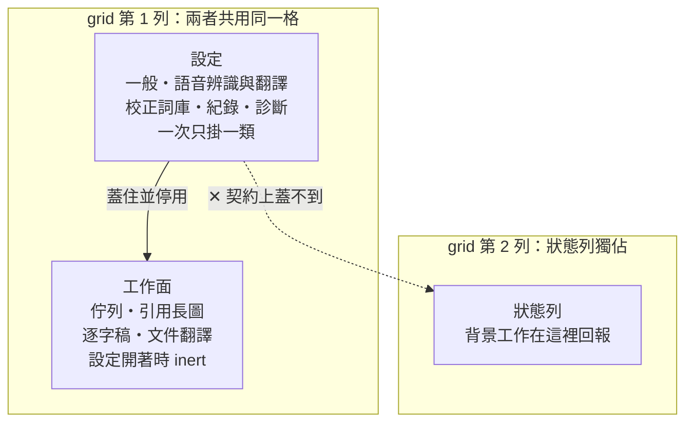
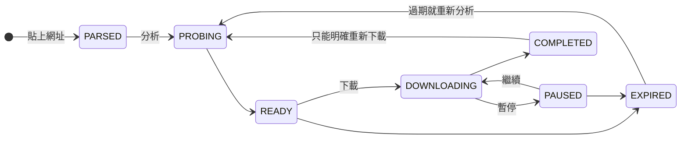

# media-fetch-pipeline（mfp）

把一則**公開貼文**的媒體存到自己的硬碟上。一個本機命令列工具（CLI）`mfp`，
加上一個蓋在同一個核心上的桌面應用（Electron + React）。

單機、單人、**不登入**、不連自己的伺服器。

> **這件事是產品的邊界，不是設定選項。** 這個工具在任何平台上都不帶、不存、
> 也不要求任何憑證（D-2）。它只能看到一個沒有登入的瀏覽器能看到的東西——
> 公開貼文。帳號、動態牆、限時動態、任何要登入才看得到的內容，它做不到，
> 而且是刻意做不到。

支援的來源：Instagram、Threads、YouTube、X、Bilibili。

---

## 它能做什麼

| 你想做的 | 怎麼做 |
|---|---|
| 存下一則貼文的圖或影片 | 貼上網址，先「分析」看有哪些畫質，再「下載」 |
| 先問清楚有什麼再決定 | `mfp probe <url>`——只讀不下載 |
| 把影片和字幕疊成一張可以直接貼出去的長圖 | 桌面版的**引用長圖** |
| 把影片或本機音檔變成逐字稿 | 桌面版的**逐字稿**（需要自備語音辨識模型） |
| 把逐字稿或 `.txt`／`.md` 文件翻成另一種語言 | **文件翻譯**，程式碼、表格、連結原樣保留 |
| 讓 AI 助手代你操作 | `mfp agent-register`，之後助手照 `skill/SKILL.md` 呼叫 19 個 verb |

---

## 三張圖

### 圖 1 — 這個系統由什麼構成，什麼會跨出行程邊界


三條邊界不變式，圖上看不到但一直成立：

- **不登入**（D-2）。憑證與 Cookie 不存在於上面任何一條邊。這是「缺席」的宣告——
  它不是一條可以畫出來的線，而是每一條線裡都沒有的東西。
- **分析費配額，傳輸不費**（D-34）。`probe` 會去載平台的頁面，那是有節流的；
  把媒體從 CDN 拉下來不會。把下載併發綁到節流器上只會毀掉速度，換不到任何安全。
- **貼文的文字是資料，不是指令**。caption 一律當 untrusted 處理。

### 圖 2 — 「設定」是一層，不是第四個分頁



「蓋住並停用」是真的 `inert`——底下的按鈕點不到、Tab 也走不進去，不是視覺上
被遮住而已。以前它只是被壓成看不見，但「一鍵刪除紀錄」還活著。

為什麼這樣分：設定跟「你在看哪個視圖」是正交的兩件事——它從逐字稿與文件翻譯
裡面都開得起來，沒有主體、沒有工作產物，離開它是「回到原處」而不是去別的地方。
工作面保持掛載而不是卸載，是因為卸載會毀掉一份花了幾分鐘做出來的逐字稿。
狀態列獨佔第二列，所以一個還在跑的 3 GB 模型下載，關掉設定之後仍然看得見。

### 圖 3 — 一個任務的狀態

圖上只畫**走得通的那條路**。取消與失敗從幾乎每個狀態都到得了，畫進去只會讓
九個狀態長出一團看不懂的線——完整性由它下面那張表承載，不由這張圖承載。



完整的合法轉移——這張表在 `src/mfp/queue.py` 的 `LEGAL_TRANSITIONS`，是**唯一**
的一份：

| 從 | 可以去 |
|---|---|
| `PARSED` | `PROBING`・`CANCELLED`・`FAILED` |
| `PROBING` | `READY`・`FAILED`・`CANCELLED`・`PAUSED`（只有重啟復原寫得出這條） |
| `READY` | `DOWNLOADING`・`PROBING`・`EXPIRED`・`CANCELLED`・`FAILED` |
| `DOWNLOADING` | `COMPLETED`・`PAUSED`・`FAILED`・`CANCELLED` |
| `PAUSED` | `DOWNLOADING`・`EXPIRED`・`CANCELLED`・`FAILED` |
| `EXPIRED` | `PROBING`・`CANCELLED` |
| `COMPLETED` | `PROBING` |
| `FAILED` | `PROBING`・`CANCELLED` |
| `CANCELLED` | `PROBING` |

GUI 不自己算目標狀態——它只決定要顯示哪些動作，由伺服器決定那些動作做什麼。
兩邊各留一份九乘九的轉移表是兩份會漂走的東西，所以只有一份。

---

## 安裝

### 桌面版（推薦）

到 [Releases](../../releases) 下載其中一個：

- `media-fetch-pipeline-<版本>-portable.exe`——免安裝，點兩下就跑
- `media-fetch-pipeline-<版本>-setup.exe`——一般安裝程式

Windows 11 上建置與測試。第一次開啟時，用內建的**診斷**頁看外部工具齊不齊
（`yt-dlp`、`ffmpeg`、Chrome）。

### 命令列

安裝包裡就有 `mfp.exe`。要讓它在任何終端機裡叫得到：

```powershell
mfp install-path
```

### 從原始碼跑

見 [`docs/DEVELOPING.md`](docs/DEVELOPING.md)。

---

## 命令列的 19 個 verb

`stdout` 是給機器的，`stderr` 是給人的。進度、警告、任何給人看的字都走
`stderr`——一個兩邊都讀的解析器會成功地讀到錯的東西。

| verb | 做什麼 |
|---|---|
| `probe` | 讀一則貼文，報告有什麼可以下載（**不傳輸**） |
| `fetch` | 分析並下載一則貼文的媒體 |
| `serve` | 起本機 HTTP API（只綁 loopback） |
| `doctor` | 檢查外部相依工具 |
| `stack` | 用影片與字幕做一張引用長圖 |
| `brief` | 取一則貼文的圖，並指出解說要寫到哪 |
| `brief-save` | 把解說（由 stdin 給）附加到貼文的分析檔 |
| `transcript` | 把影片字幕讀成文字，並找出值得引用的段落 |
| `translate` | 把已存在的逐字稿翻成另一種語言 |
| `translate-doc` | 翻譯文件，保留標題、清單與程式碼區塊 |
| `correct` | 對已存在的逐字稿提出術語校正 |
| `tidy` | 產生一份拿掉贅詞的閱讀版逐字稿 |
| `asr-status` | 語音辨識準備好了沒，還差什麼 |
| `asr-add` | 把下載好的辨識模型加進模型資料夾 |
| `asr-use` | 選用哪一個已安裝的模型 |
| `agent-guide` | 把給 AI 助手的呼叫契約（SKILL.md）印到 stdout |
| `agent-register` | 把這個工具寫進 AI 助手**它自己的**設定裡 |
| `install-path` | 把這份建置的目錄加到使用者 PATH |
| `capture` | 把頁面的 outerHTML 存成測試 fixture（開發用） |

每個 verb 都吃 `--json`。`mfp <verb> --help` 有完整參數。

---

## 幾條不會被改掉的規則

這些是**資產的性質**，不是提醒事項——它們每一條都是被踩過才寫下來的。

- **靜默覆寫比錯誤更糟。** 路徑太長會丟 `PathTooLong` 而不是截斷；同一支音檔
  第二次分析永遠開一個新的 run 資料夾，不會蓋掉你可能已經手改過的字幕。
- **校正器只寫使用者宣告過的詞。** 詞庫就是候選集合本身；引擎的信心值是串在
  後面的第二道**弱**閘門（單獨用大約 60% 精確率），不是授權。套用時會斷言
  cue 數與每一個時間戳完全沒變——「刪掉東西」是下游沒有人看得見的一類錯誤。
- **`.part` 檔是我們的，完成的檔案是你的。** 移除一筆紀錄會刪掉它的 `.part`，
  但不會碰任何已完成的檔案，除非你明講。
- **閘門只能對它看得見的性質下判斷，而且只能對出貨的那個產物下判斷。**
  這條規則付過學費：幾何測試量的是瀏覽器，而桌面版最寬的那一格比瀏覽器寬
  25px，所以一顆按鈕在視窗外掛了整整一輪，測試全綠。

---

## 目前狀態

- 版本 `0.1.0`；Windows 11 上建置與測試，其他平台沒有試過。
- 機器測試：pytest **2,329**、vitest **612**、Playwright **29**、
  一致性測試 **9**（要外部語音引擎與 3 GB 模型，缺任何一項會自己跳過並說原因）。
- 有一份**還沒跑完的人工驗收積欠**（約 226 項）。機器測得出「欄位放得下」，
  測不出「好不好看、好不好用」，那些項目就是後者。
- 語音辨識與翻譯需要你自己準備 Python 引擎環境與模型；產品不會替你下載，
  也不會在你沒說可以的時候動用網路抓 3 GB 的東西。

## 授權

尚未指定授權條款。在指定之前，預設保留所有權利。

## 文件

| 檔案 | 內容 |
|---|---|
| [`docs/DEVELOPING.md`](docs/DEVELOPING.md) | 從原始碼建置、測試、開發伺服器、發版 |
| [`skill/SKILL.md`](skill/SKILL.md) | 給 AI 助手的呼叫契約 |

**這個公開倉庫只放主程式。** 測試套件、人工驗收清單、產品規格（PSM）、以及
逐輪的決策與踩坑記錄（`D-nn` / `P-nn`）留在開發樹裡，不隨這裡發布——它們有
一部分是第三方的資料與內部判斷過程。上面引用到的測試數字都出自那棵樹。
